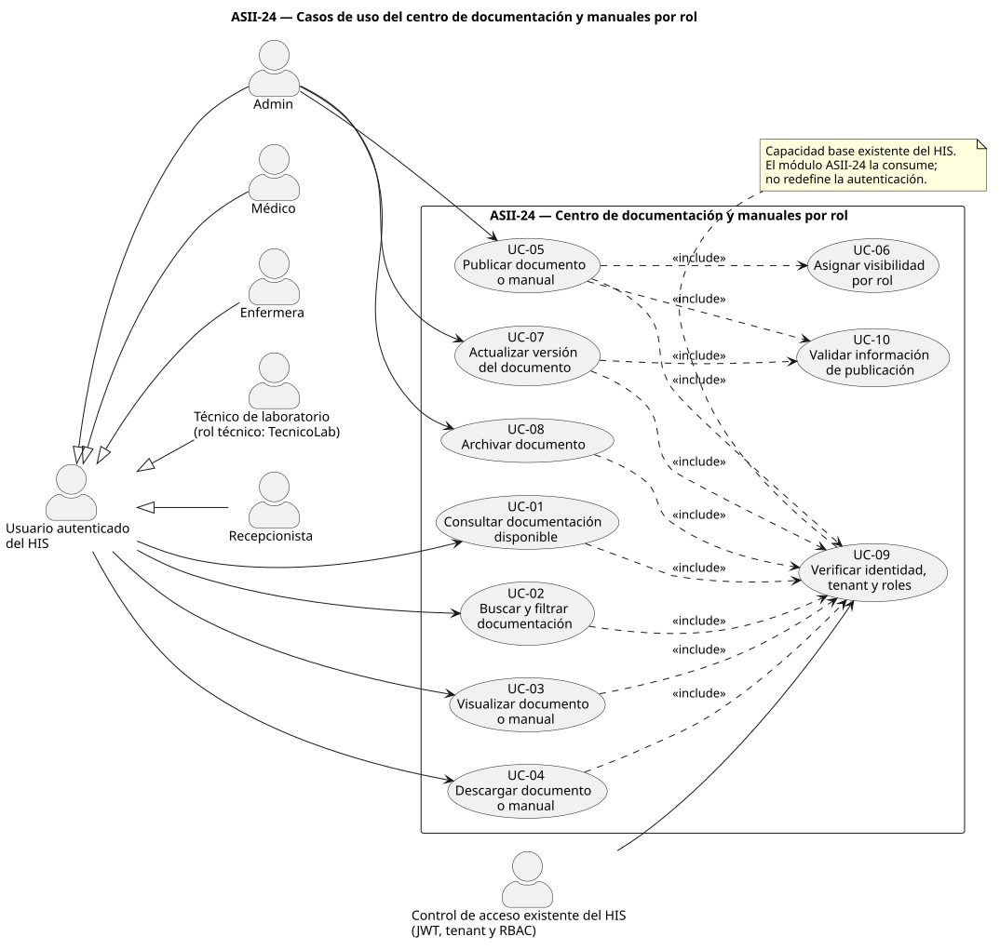
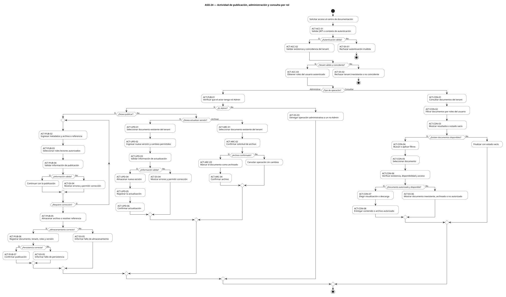
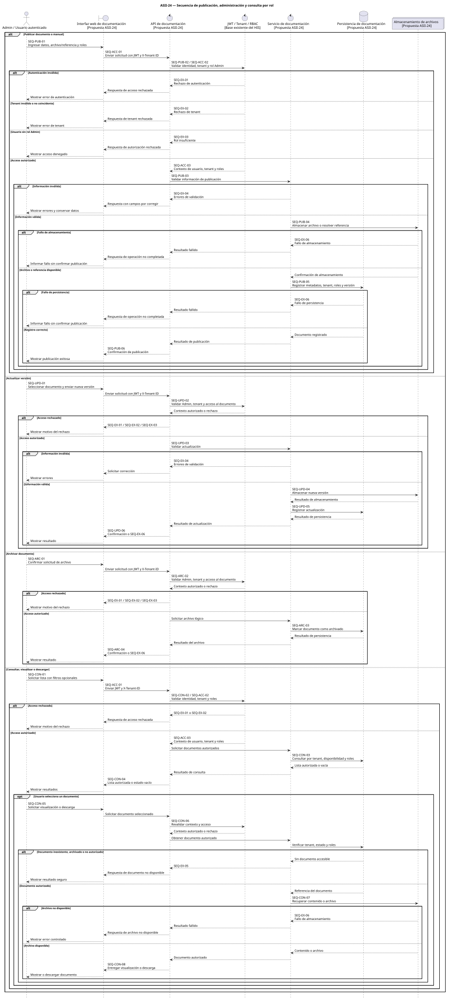

# UML ASII-24 — Contratos API y documentación técnica

Repositorio personal de evidencia académica correspondiente a la **Asignación 24**
del curso de **Análisis de Sistemas II**.

Este repositorio reúne los artefactos elaborados para modelar el proceso de
**publicación y consulta de documentación y manuales diferenciados por rol**,
como adaptación académica del módulo oficial **Contratos API: OpenAPI/Postman y
documentación técnica**.

---

## Información del estudiante

| Campo                                    | Detalle                                                                                                                                      |
| ---------------------------------------- | -------------------------------------------------------------------------------------------------------------------------------------------- |
| Estudiante                               | **Albino Sebastián Rosales Ruano**                                                                                                           |
| GitHub                                   | [`codsebas`](https://github.com/codsebas)                                                                                                    |
| Asignación                               | **ASII-24**                                                                                                                                  |
| Módulo oficial                           | **Contratos API: OpenAPI/Postman y documentación técnica**                                                                                   |
| Repositorio                              | [`UML-asii-24-codsebas`](https://github.com/codsebas/UML-asii-24-codsebas)                                                                   |
| Rama principal                           | `main`                                                                                                                                       |
| Repositorio del proyecto                 | [`sistema-hospitalario-integrado-SistenasII-2026`](https://github.com/compilations-teams/sistema-hospitalario-integrado-SistenasII-2026.git) |
| Rama dentro del repositorio del proyecto | `feature/asii-24-contratos-api-openapi-postman-y-documentac-codsebas`                                                                        |

---

## Objetivo de la asignación

La actividad modela el proceso:

> **“Publicación y consulta de documentación y manuales diferenciados por rol.”**

Los tres diagramas UML representan perspectivas complementarias y mantienen
coherencia entre actores, pasos, mensajes, validaciones y excepciones:

1. **Casos de uso:** delimita actores, objetivo y capacidades del módulo.
2. **Actividad:** representa decisiones, excepciones y resultados del flujo.
3. **Secuencia:** muestra participantes, mensajes, validaciones y respuestas.

La solución corresponde a una **propuesta de análisis y diseño**. No implica que
el centro de documentación y manuales se encuentre implementado en el HIS.

---

## Alcance modelado

El módulo propuesto contempla:

- publicación, actualización y archivo de documentación por el rol `Admin`;
- asignación de roles autorizados para consultar cada documento;
- consulta de documentación según los roles del usuario autenticado;
- aislamiento de la información por `tenant`;
- validación de autenticación, tenant y roles;
- visualización y descarga controlada de documentación;
- decisiones, excepciones y resultados alternativos;
- trazabilidad entre los tres diagramas UML.

---

## Actores principales

- **Usuario autenticado del HIS**
- **Admin**
- **Médico**
- **Enfermera**
- **Técnico de laboratorio (`TecnicoLab`)**
- **Recepcionista**
- **Control de acceso existente del HIS** mediante autenticación, tenant y RBAC

---

## Estructura del repositorio

```text
.
├── README.md
├── DECLARACION_IA.md
└── week-01/
    ├── README.md
    ├── 01-scope-actors-use-cases.md
    ├── 02-activity-sequence-traceability.md
    ├── diagrams/
    │   ├── use-case-diagram.svg
    │   ├── activity-diagram.svg
    │   └── sequence-diagram.svg
    ├── diagrams-code/
    │   ├── use-case-diagram.puml
    │   ├── activity-diagram.puml
    │   └── sequence-diagram.puml
    └── evidence-prompts/
        └── ...
```

### Carpetas principales

- [`week-01/`](week-01/) — Evidencia de la primera semana.
- [`week-01/diagrams/`](week-01/diagrams/) — Diagramas renderizados en SVG.
- [`week-01/diagrams-code/`](week-01/diagrams-code/) — Fuentes editables
  PlantUML.
- [`week-01/evidence-prompts/`](week-01/evidence-prompts/) — Prompts relevantes
  utilizados como evidencia del apoyo de IA.

---

## Entregables de la Semana 1

### Alcance, actores y casos de uso

Documento:

[`week-01/01-scope-actors-use-cases.md`](week-01/01-scope-actors-use-cases.md)

Contiene el contexto, objetivo, límite del sistema, actores, reglas propuestas,
procesos principales, catálogo `UC-01` a `UC-10` y diagrama de casos de uso.

### Actividad, secuencia y trazabilidad

Documento:

[`week-01/02-activity-sequence-traceability.md`](week-01/02-activity-sequence-traceability.md)

Contiene el diagrama de actividad, decisiones, excepciones, participantes,
diagrama de secuencia, validaciones, respuestas y matriz de trazabilidad.

---

## Diagramas UML

### Casos de uso



### Actividad



### Secuencia



Las fuentes editables se encuentran en
[`week-01/diagrams-code/`](week-01/diagrams-code/).

---

## Trazabilidad

La documentación utiliza identificadores estables:

| Tipo                  | Identificadores |
| --------------------- | --------------- |
| Casos de uso          | `UC-*`          |
| Actividades           | `ACT-*`         |
| Mensajes de secuencia | `SEQ-*`         |

La matriz de trazabilidad permite comprobar que los tres diagramas representan
el mismo proceso desde perspectivas distintas.

---

## Evidencia Git

El repositorio conserva el historial de cambios realizado durante la actividad.

Comandos útiles para verificar la evidencia:

```bash
git log --oneline
git log --stat
git status
git show <commit>
```

Para la entrega se debe registrar claramente el **commit o etiqueta evaluada**.

---

## Uso de inteligencia artificial

Durante la elaboración de la actividad se utilizó asistencia de inteligencia
artificial como apoyo para:

- analizar la consigna;
- estructurar la documentación;
- revisar coherencia entre artefactos;
- preparar propuestas de diagramas y trazabilidad;
- revisar formato y consistencia.

Los prompts relevantes se conservan en
[`week-01/evidence-prompts/`](week-01/evidence-prompts/).

El contenido incorporado al repositorio debe ser revisado y validado
manualmente. La entrega académica contempla además un archivo
`DECLARACION_IA.md` con la herramienta utilizada, propósito, prompts relevantes,
partes aceptadas o modificadas y validación humana.

---

## Reproducibilidad

Los diagramas no se entregan únicamente como imágenes. Cada archivo SVG posee
una fuente editable en PlantUML dentro de `week-01/diagrams-code/`, lo cual
permite revisar, modificar y volver a renderizar los artefactos.

---

## Preparación para defensa oral

La evidencia está organizada para poder explicar:

- objetivo y alcance del módulo;
- actores involucrados;
- diferencias entre los tres diagramas UML;
- decisiones y excepciones principales;
- trazabilidad entre `UC-*`, `ACT-*` y `SEQ-*`;
- reglas relacionadas con roles y tenant;
- limitaciones del diseño;
- modificaciones solicitadas durante la defensa.

---

## Estado de la evidencia

- [x] Alcance y actores documentados.
- [x] Casos de uso documentados.
- [x] Diagrama UML de casos de uso.
- [x] Diagrama UML de actividad.
- [x] Diagrama UML de secuencia.
- [x] Matriz de trazabilidad.
- [x] Diagramas SVG.
- [x] Fuentes editables PlantUML.
- [x] Evidencia de prompts.
- [x] `DECLARACION_IA.md` verificado para la entrega final.
- [x] Documento final PDF/DOCX verificado.
- [x] Commit o etiqueta evaluada registrado en el documento final.
- [x] Guía breve para defensa oral verificada.

---

## Autor

**Albino Sebastián Rosales Ruano**  
GitHub: [`codsebas`](https://github.com/codsebas)  
Asignación: **ASII-24**
