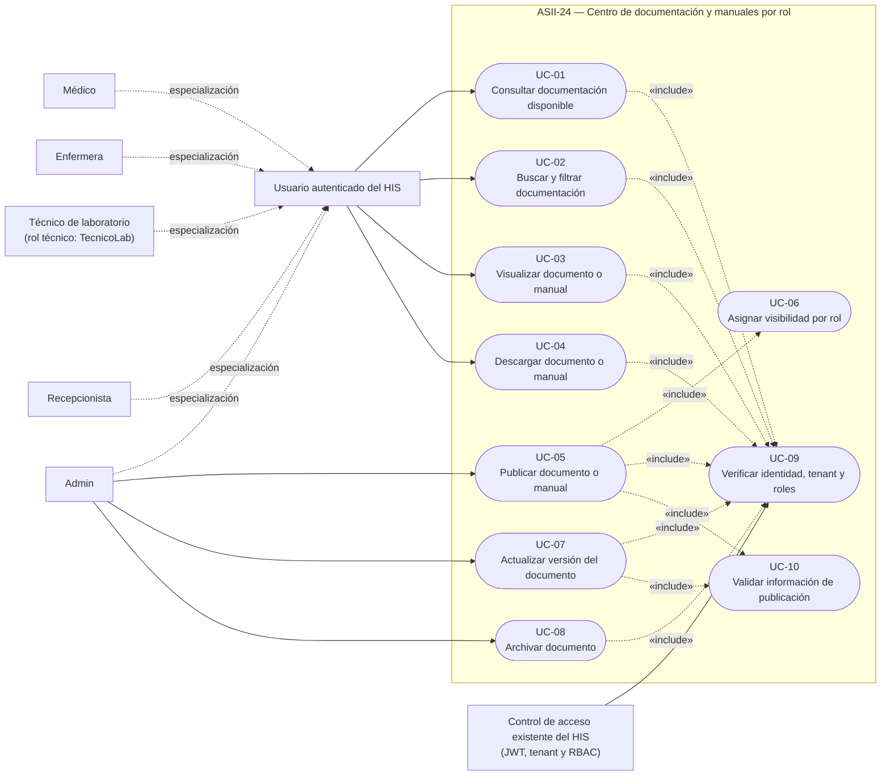
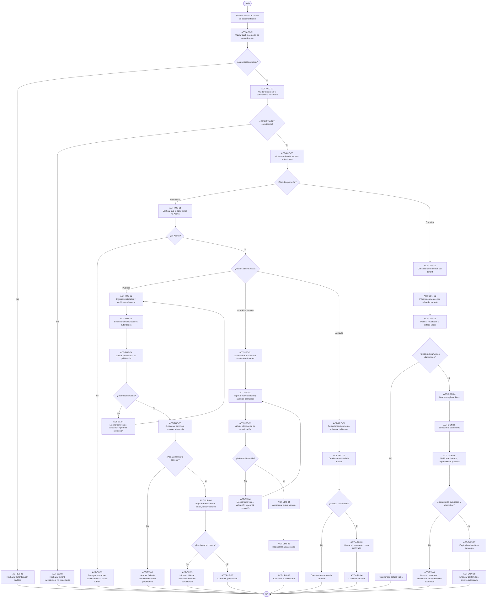

# ASII-24 — Strict PlantUML-to-Mermaid Migration

## 1. Role and mission

Act as a conservative documentation-maintenance agent inside the assigned ASII-24 Git worktree.

Your only mission is to migrate the three existing Week 1 diagrams from separate PlantUML (`.puml`) files to Mermaid blocks embedded directly in the existing Markdown documents, while preserving the already approved academic content, identifiers, actors, rules, and traceability.

This is a format migration only. It is not a redesign, implementation task, or opportunity to improve unrelated documentation.

Do not perform Git operations. Do not continue if any mandatory precondition fails.

---

## 2. Verified current snapshot

The current worktree is expected to contain exactly these ASII-24 Week 1 files:

```text
docs/asii-24/
├── task.md
└── week-01/
    ├── README.md
    ├── 01-scope-actors-use-cases.md
    ├── 02-activity-sequence-traceability.md
    └── diagrams/
        ├── use-case-diagram.puml
        ├── activity-diagram.puml
        └── sequence-diagram.puml
```

The current Markdown documents contain links to the `.puml` files and statements explaining that SVG files were not generated because no local PlantUML renderer was available.

The current `README.md` also contains a contradictory status: it says Phase 2 is pending in one section and completed in another section.

Verify this snapshot directly before editing. Do not rely only on this description.

---

## 3. Allowed changes

You may modify only these files:

```text
docs/asii-24/week-01/README.md
docs/asii-24/week-01/01-scope-actors-use-cases.md
docs/asii-24/week-01/02-activity-sequence-traceability.md
```

You may delete only these files:

```text
docs/asii-24/week-01/diagrams/use-case-diagram.puml
docs/asii-24/week-01/diagrams/activity-diagram.puml
docs/asii-24/week-01/diagrams/sequence-diagram.puml
```

After deleting those files, the empty `diagrams/` directory may disappear naturally because Git does not track empty directories.

Do not create SVG, PNG, PDF, `.mmd`, `.mermaid`, `.puml`, HTML, JavaScript, or any other diagram artifact.

Do not create or modify files outside `docs/asii-24/week-01/`.

Do not modify, delete, stage, or commit:

```text
docs/asii-24/task.md
docs/asii-24/mermaid-migration-task.md
```

If this prompt is saved under another temporary filename, do not modify, delete, stage, or commit that file either.

---

## 4. Mandatory pre-edit inspection

Before changing anything, run read-only checks equivalent to:

```bash
pwd
git branch --show-current
git status --short
git worktree list
find docs/asii-24/week-01 -maxdepth 3 -type f -print
rg -n "\\.puml|PlantUML|renderer|SVG|Phase 2 pendiente" docs/asii-24/week-01
```

Inspect the complete contents of:

```text
docs/asii-24/week-01/README.md
docs/asii-24/week-01/01-scope-actors-use-cases.md
docs/asii-24/week-01/02-activity-sequence-traceability.md
docs/asii-24/week-01/diagrams/use-case-diagram.puml
docs/asii-24/week-01/diagrams/activity-diagram.puml
docs/asii-24/week-01/diagrams/sequence-diagram.puml
```

### Mandatory stop conditions

Stop without modifying files if any of the following is true:

1. The current branch is not:

   ```text
   feature/asii-24-contratos-api-openapi-postman-y-documentac-codsebas
   ```

2. Any required Markdown or `.puml` file is missing.
3. Any target file already contains uncommitted changes.
4. Mermaid diagrams are already embedded in the target sections.
5. The existing actors, use cases, activity IDs, sequence IDs, or traceability materially differ from the designs specified in this prompt.
6. Completing the migration would require editing any file outside the explicitly allowed paths.
7. The repository contains a conflict marker such as `<<<<<<<`, `=======`, or `>>>>>>>` in any target document.

When stopping, report the exact failed condition and do nothing else.

---

## 5. Non-negotiable preservation rules

Preserve all approved Week 1 semantics:

- Existing HIS capabilities remain distinguished from proposed ASII-24 behavior.
- `Admin` remains the only proposed publisher and document administrator.
- Reader roles remain:
  - `Médico`
  - `Enfermera`
  - `TecnicoLab`
  - `Recepcionista`
- Tenant isolation remains mandatory.
- Use cases remain exactly `UC-01` through `UC-10`.
- Activity identifiers remain exactly the approved `ACT-*` identifiers.
- Sequence identifiers remain exactly the approved `SEQ-*` identifiers.
- The traceability matrix remains unchanged unless a purely textual link/reference correction is required.
- No endpoints, HTTP methods, payloads, status codes, OpenAPI, Postman, RF/RNF, database schema, classes, implementation, tests, UI, architecture, or later-week deliverables may be introduced.

Do not rename, remove, merge, split, reorder, or reinterpret approved cases, actors, activities, messages, exceptions, or results.

Do not rewrite unaffected narrative sections merely for style.

---

# REQUIRED MIGRATION

## 6. Replace the use-case diagram section

In:

```text
docs/asii-24/week-01/01-scope-actors-use-cases.md
```

Keep Sections 1 through 12 and Section 14 unchanged.

Replace only the current content under:

```text
## 13. Diagrama UML de casos de uso
```

with a concise Spanish explanation and the exact Mermaid block below.

The explanation must state that Mermaid does not provide a native use-case diagram type, so a `flowchart`-based equivalent is used while preserving actors, the module boundary, use cases, generalization, and `«include»` relationships. Do not mention PlantUML, SVG, a missing renderer, or local tooling.

Use this exact Mermaid semantic design:



Do not add CSS classes, custom colors, themes, icons, emojis, or initialization directives.

---

## 7. Replace the activity diagram section

In:

```text
docs/asii-24/week-01/02-activity-sequence-traceability.md
```

Keep the section title:

```text
## 3. Diagrama UML de actividad
```

Replace only its current paragraph that links to `activity-diagram.puml` with a concise Spanish introduction and the exact Mermaid block below.

The introduction must explain that the Mermaid flowchart preserves the activity decisions, exceptions, and outcomes. Do not mention PlantUML, SVG, a missing renderer, or local tooling.



Do not simplify the flow. Do not omit any `ACT-*` identifier.

---

## 8. Replace the sequence diagram section

In the same file:

```text
docs/asii-24/week-01/02-activity-sequence-traceability.md
```

Keep the section title:

```text
## 6. Diagrama UML de secuencia
```

Replace only its current paragraph that links to `sequence-diagram.puml` with a concise Spanish introduction and the exact Mermaid block below.

The introduction must state that the sequence diagram distinguishes existing HIS access control from proposed ASII-24 participants. Do not mention PlantUML, SVG, a missing renderer, or local tooling.

```mermaid
sequenceDiagram
    actor User as Admin / Usuario autenticado
    participant UI as Interfaz web de documentación [Propuesta ASII-24]
    participant API as API de documentación [Propuesta ASII-24]
    participant Access as JWT / Tenant / RBAC [Base existente del HIS]
    participant Service as Servicio de documentación [Propuesta ASII-24]
    participant DB as Persistencia de documentación [Propuesta ASII-24]
    participant Storage as Almacenamiento de archivos [Propuesta ASII-24]

    alt Publicar documento o manual
        User->>UI: SEQ-PUB-01 Ingresar datos, archivo/referencia y roles
        UI->>API: SEQ-ACC-01 Enviar solicitud con JWT y X-Tenant-ID
        API->>Access: SEQ-PUB-02 / SEQ-ACC-02 Validar identidad, tenant y rol Admin

        alt Autenticación inválida
            Access-->>API: SEQ-EX-01 Rechazo de autenticación
            API-->>UI: Respuesta de acceso rechazada
            UI-->>User: Mostrar error de autenticación
        else Tenant inválido o no coincidente
            Access-->>API: SEQ-EX-02 Rechazo de tenant
            API-->>UI: Respuesta de tenant rechazada
            UI-->>User: Mostrar error de tenant
        else Usuario sin rol Admin
            Access-->>API: SEQ-EX-03 Rol insuficiente
            API-->>UI: Respuesta de autorización rechazada
            UI-->>User: Mostrar acceso denegado
        else Acceso autorizado
            Access-->>API: SEQ-ACC-03 Contexto de usuario, tenant y roles
            API->>Service: SEQ-PUB-03 Validar información de publicación

            alt Información inválida
                Service-->>API: SEQ-EX-04 Errores de validación
                API-->>UI: Respuesta con campos por corregir
                UI-->>User: Mostrar errores y conservar datos
            else Información válida
                Service->>Storage: SEQ-PUB-04 Almacenar archivo o resolver referencia

                alt Fallo de almacenamiento
                    Storage-->>Service: SEQ-EX-06 Fallo de almacenamiento
                    Service-->>API: Resultado fallido
                    API-->>UI: Respuesta de operación no completada
                    UI-->>User: Informar fallo sin confirmar publicación
                else Archivo o referencia disponible
                    Storage-->>Service: Confirmación de almacenamiento
                    Service->>DB: SEQ-PUB-05 Registrar metadatos, tenant, roles y versión

                    alt Fallo de persistencia
                        DB-->>Service: SEQ-EX-06 Fallo de persistencia
                        Service-->>API: Resultado fallido
                        API-->>UI: Respuesta de operación no completada
                        UI-->>User: Informar fallo sin confirmar publicación
                    else Registro correcto
                        DB-->>Service: Documento registrado
                        Service-->>API: Resultado de publicación
                        API-->>UI: SEQ-PUB-06 Confirmación de publicación
                        UI-->>User: Mostrar publicación exitosa
                    end
                end
            end
        end

    else Actualizar versión
        User->>UI: SEQ-UPD-01 Seleccionar documento y enviar nueva versión
        UI->>API: Enviar solicitud con JWT y X-Tenant-ID
        API->>Access: SEQ-UPD-02 Validar Admin, tenant y acceso al documento
        Access-->>API: Contexto autorizado o rechazo

        alt Acceso rechazado
            API-->>UI: SEQ-EX-01 / SEQ-EX-02 / SEQ-EX-03
            UI-->>User: Mostrar motivo del rechazo
        else Acceso autorizado
            API->>Service: SEQ-UPD-03 Validar actualización

            alt Información inválida
                Service-->>API: SEQ-EX-04 Errores de validación
                API-->>UI: Solicitar corrección
                UI-->>User: Mostrar errores
            else Información válida
                Service->>Storage: SEQ-UPD-04 Almacenar nueva versión
                Storage-->>Service: Resultado de almacenamiento
                Service->>DB: SEQ-UPD-05 Registrar actualización
                DB-->>Service: Resultado de persistencia
                Service-->>API: Resultado de actualización
                API-->>UI: SEQ-UPD-06 Confirmación o SEQ-EX-06
                UI-->>User: Mostrar resultado
            end
        end

    else Archivar documento
        User->>UI: SEQ-ARC-01 Confirmar solicitud de archivo
        UI->>API: Enviar solicitud con JWT y X-Tenant-ID
        API->>Access: SEQ-ARC-02 Validar Admin, tenant y acceso al documento
        Access-->>API: Contexto autorizado o rechazo

        alt Acceso rechazado
            API-->>UI: SEQ-EX-01 / SEQ-EX-02 / SEQ-EX-03
            UI-->>User: Mostrar motivo del rechazo
        else Acceso autorizado
            API->>Service: Solicitar archivo lógico
            Service->>DB: SEQ-ARC-03 Marcar documento como archivado
            DB-->>Service: Resultado de persistencia
            Service-->>API: Resultado del archivo
            API-->>UI: SEQ-ARC-04 Confirmación o SEQ-EX-06
            UI-->>User: Mostrar resultado
        end

    else Consultar, visualizar o descargar
        User->>UI: SEQ-CON-01 Solicitar lista con filtros opcionales
        UI->>API: SEQ-ACC-01 Enviar JWT y X-Tenant-ID
        API->>Access: SEQ-CON-02 / SEQ-ACC-02 Validar identidad, tenant y roles

        alt Acceso rechazado
            Access-->>API: SEQ-EX-01 o SEQ-EX-02
            API-->>UI: Respuesta de acceso rechazada
            UI-->>User: Mostrar motivo del rechazo
        else Acceso autorizado
            Access-->>API: SEQ-ACC-03 Contexto de usuario, tenant y roles
            API->>Service: Solicitar documentos autorizados
            Service->>DB: SEQ-CON-03 Consultar por tenant, disponibilidad y roles
            DB-->>Service: Lista autorizada o vacía
            Service-->>API: Resultado de consulta
            API-->>UI: SEQ-CON-04 Lista autorizada o estado vacío
            UI-->>User: Mostrar resultados

            opt Usuario selecciona un documento
                User->>UI: SEQ-CON-05 Solicitar visualización o descarga
                UI->>API: Solicitar documento seleccionado
                API->>Access: SEQ-CON-06 Revalidar contexto y acceso
                Access-->>API: Contexto autorizado o rechazo
                API->>Service: Obtener documento autorizado
                Service->>DB: Verificar tenant, estado y roles

                alt Documento inexistente, archivado o no autorizado
                    DB-->>Service: Sin documento accesible
                    Service-->>API: SEQ-EX-05
                    API-->>UI: Respuesta de documento no disponible
                    UI-->>User: Mostrar resultado seguro
                else Documento autorizado
                    DB-->>Service: Referencia del documento
                    Service->>Storage: SEQ-CON-07 Recuperar contenido o archivo

                    alt Archivo no disponible
                        Storage-->>Service: SEQ-EX-06 Fallo de almacenamiento
                        Service-->>API: Resultado fallido
                        API-->>UI: Respuesta de archivo no disponible
                        UI-->>User: Mostrar error controlado
                    else Archivo disponible
                        Storage-->>Service: Contenido o archivo
                        Service-->>API: Documento autorizado
                        API-->>UI: SEQ-CON-08 Entregar visualización o descarga
                        UI-->>User: Mostrar o descargar documento
                    end
                end
            end
        end
    end
```



Do not omit any approved publication, update, archive, consultation, validation, or exception branch.

---

## 9. Replace the Week 1 README with a consistent index

Replace the complete contents of:

```text
docs/asii-24/week-01/README.md
```

with the following exact Spanish content:

```markdown
# ASII-24 — Evidencia de la Semana 1

- Estudiante: ALBINO SEBASTIAN ROSALES RUANO
- GitHub: `codsebas`
- Módulo oficial: Contratos API: OpenAPI/Postman y documentación técnica
- Actividad adaptada: Centro de documentación y manuales por rol
- Naturaleza: evidencia de análisis y diseño, no de un módulo implementado

## Estado de la entrega

- Phase 1 completada
- Phase 2 completada
- Semana 1 completada con alcance, actores, casos de uso, actividad, secuencia y trazabilidad

## Entregables

- [Alcance, actores, casos de uso y diagrama integrado](01-scope-actors-use-cases.md)
- [Actividad, secuencia, excepciones y trazabilidad](02-activity-sequence-traceability.md)

Los tres diagramas están integrados directamente en los documentos Markdown mediante Mermaid para facilitar su visualización en GitHub.

## Nota de alcance

El repositorio ya incluye capacidades base del HIS para autenticación JWT, tenant por `X-Tenant-ID` y RBAC con roles semilla. El centro de documentación y manuales por rol es un diseño propuesto para ASII-24 y no debe leerse como una funcionalidad ya implementada.
```

Do not add links to files under `diagrams/` or `images/`.

---

## 10. Delete the PlantUML source files

After the Mermaid blocks are embedded successfully, delete exactly:

```text
docs/asii-24/week-01/diagrams/use-case-diagram.puml
docs/asii-24/week-01/diagrams/activity-diagram.puml
docs/asii-24/week-01/diagrams/sequence-diagram.puml
```

Do not delete any Markdown document.

Do not create replacement source files.

---

## 11. Mandatory validation

Perform all of the following read-only validations after editing:

### 11.1 Path and scope validation

Confirm that only the following tracked Week 1 paths changed:

```text
docs/asii-24/week-01/README.md
docs/asii-24/week-01/01-scope-actors-use-cases.md
docs/asii-24/week-01/02-activity-sequence-traceability.md
docs/asii-24/week-01/diagrams/use-case-diagram.puml       [deleted]
docs/asii-24/week-01/diagrams/activity-diagram.puml       [deleted]
docs/asii-24/week-01/diagrams/sequence-diagram.puml       [deleted]
```

### 11.2 Removed-reference validation

The following search must return no matches under `docs/asii-24/week-01/`:

```bash
rg -n "\\.puml|PlantUML|renderer PlantUML|No se generó SVG|Phase 2 pendiente" docs/asii-24/week-01
```

### 11.3 Mermaid presence validation

Confirm:

- `01-scope-actors-use-cases.md` contains exactly one `mermaid` fenced block.
- `02-activity-sequence-traceability.md` contains exactly two `mermaid` fenced blocks.
- `README.md` contains no Mermaid block.

### 11.4 Identifier validation

Confirm the use-case Mermaid block includes every identifier from `UC-01` through `UC-10`.

Confirm the activity Mermaid block includes all of these families:

```text
ACT-ACC-01..03
ACT-PUB-01..07
ACT-UPD-01..06
ACT-ARC-01..04
ACT-CON-01..08
ACT-EX-01..06
```

Confirm the sequence Mermaid block includes all of these families:

```text
SEQ-ACC-01..03
SEQ-PUB-01..06
SEQ-UPD-01..06
SEQ-ARC-01..04
SEQ-CON-01..08
SEQ-EX-01..06
```

### 11.5 Traceability preservation

Confirm every row from `UC-01` through `UC-10` remains present in the traceability matrix and its approved `ACT-*` and `SEQ-*` mappings were not altered.

### 11.6 Markdown and whitespace validation

Run checks equivalent to:

```bash
git diff --check
rg -n "<<<<<<<|=======|>>>>>>>" docs/asii-24/week-01
```

There must be no whitespace errors or conflict markers.

### 11.7 Git diff review

Review the final diff and confirm no backend, frontend, configuration, dependencies, tests, original task file, or later-week document was touched.

Do not stage any file.

---

## 12. Forbidden actions

You must not:

- modify `docs/asii-24/task.md`;
- modify this temporary migration prompt;
- edit `AGENTS.md` or create repository-wide agent rules;
- modify backend, frontend, routes, middleware, models, controllers, migrations, seeders, tests, configuration, dependencies, or environment files;
- install Mermaid CLI, PlantUML, Graphviz, plugins, packages, or extensions;
- call an external rendering service;
- generate SVG, PNG, PDF, or HTML;
- create `.mmd`, `.mermaid`, or replacement `.puml` files;
- change actors, roles, use cases, business rules, activity IDs, sequence IDs, or traceability mappings;
- introduce endpoint paths, HTTP methods, payloads, status codes, OpenAPI, Postman, RF/RNF, SOLID, implementation, architecture, tests, UI, security redesign, or deployment content;
- run `git add`, `git commit`, `git push`, `git merge`, `git rebase`, `git reset`, `git clean`, or any PR operation;
- rewrite commit history or use destructive Git commands.

---

## 13. Required final response

After completing and validating the migration, return only:

1. Confirmed branch and worktree.
2. Files modified.
3. Files deleted.
4. Mermaid block count by Markdown file.
5. Identifier and traceability validation result.
6. Confirmation that no `.puml`, PlantUML-renderer, or missing-SVG references remain in Week 1 documentation.
7. Confirmation that no Git operation was executed.
8. The recommended user command, without executing it:

```bash
git add docs/asii-24/week-01
git commit -m "docs(asii-24): replace PlantUML diagrams with Mermaid"
git push
```

End with this exact line:

> `MERMAID MIGRATION COMPLETE — READY FOR USER REVIEW. NO GIT OPERATIONS EXECUTED.`
