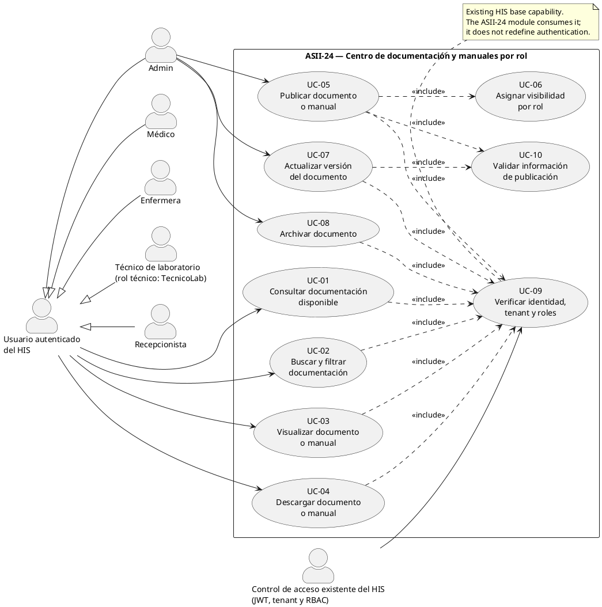
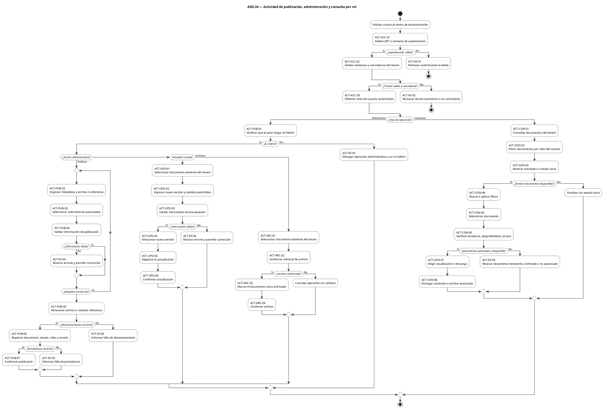

# ASII-24 — Week 1 Documentation Task

## 1. Role

Act as a careful software-analysis documentation agent working inside the assigned Git worktree for **ASII-24**.

Your job is **not** to invent or implement the module. Your job is to inspect the repository, distinguish existing facts from proposed academic design, and write the approved Week 1 documentation in Spanish.

Follow this file exactly. Do not broaden the task. Do not continue from one execution phase to the next unless the user explicitly authorizes it.

---

## 2. Assignment Context

### Official module

**Contratos API: OpenAPI/Postman y documentación técnica**

### Week 1 adapted exercise

For this exercise, model the process:

> **“Publicación y consulta de documentación y manuales diferenciados por rol.”**

This is an academic adaptation of the official API/documentation module. It is **not** a reassignment of the official module.

### Individual assignment requirements

The Week 1 evidence must contain:

1. A brief scope narrative.
2. Actors, processes, system boundary, and use cases.
3. A UML use case diagram that clearly delimits actors and the module objective.
4. A UML activity diagram containing decisions, exceptions, and final outcomes.
5. A UML sequence diagram containing participants, messages, validations, and responses.
6. Traceability among the use case, activity, and sequence diagrams.

### Commit separation required by the student

The work is intentionally divided into two reviewable documentation increments:

- **Phase 1 / first commit:** scope narrative, actors, processes, use cases, and use case diagram.
- **Phase 2 / second commit:** activity diagram, sequence diagram, exceptions, responses, and traceability.

You must stop completely after Phase 1. Phase 2 may only be executed after explicit user authorization.

---

## 3. Sources of Truth and Precedence

Use the following precedence when information conflicts:

1. The explicit decisions in this `task.md` file.
2. Facts verified directly in the current repository.
3. The ASII-24 individual assignment embedded in this file.
4. General repository documentation and templates.
5. Your own interpretation only when it does not contradict items 1–4.

Never resolve a contradiction by guessing. Report it and stop when it materially affects the deliverable.

### Mandatory repository files to inspect

Before writing any deliverable, inspect at least:

- `README.md`
- `docs/weekly-plan.md`
- `docs/worktree-guide.md`
- `.github/pull_request_template.md`
- `.github/ISSUE_TEMPLATE/module_task.md`
- `composer.json`
- `package.json`
- `routes/api.php`
- `bootstrap/app.php`
- `app/Http/Middleware/TenantMiddleware.php`
- `app/Http/Middleware/JwtAuth.php`
- `app/Http/Controllers/Api/V1/AuthController.php`
- `app/Models/User.php`
- `app/Models/Tenant.php`
- `database/seeders/RoleSeeder.php`

Also search the repository for existing documentation/manual/OpenAPI/Postman functionality before stating that it does or does not exist. Use a read-only search such as:

```bash
rg -n -i "documentation|documentacion|manual|openapi|swagger|postman|document" \
  app routes resources database docs README.md composer.json package.json
```

If `rg` is unavailable, use another read-only search command.

---

## 4. Verified Repository Baseline to Confirm

The repository snapshot is expected to show the following. You must verify these facts before using them:

- Backend: Laravel 12 and PHP 8.2+.
- Frontend: Vue 3, Vite, Pinia, Vue Router, and Axios.
- Authentication: JWT.
- Tenant context: required `X-Tenant-ID` header and tenant middleware.
- Authorization base: Spatie Laravel Permission with API guard.
- Existing seeded roles, using their exact technical names:
  - `Admin`
  - `Médico`
  - `Enfermera`
  - `TecnicoLab`
  - `Recepcionista`
- Existing API prefix: `/api/v1`.
- Current API implementation: authentication routes only.
- The documentation/manual center is expected to be **not implemented yet** and must be treated as a proposed ASII-24 design unless repository inspection proves otherwise.

### Mandatory distinction in all documents

Clearly separate:

- **Existing repository capabilities**, and
- **Proposed ASII-24 Week 1 design**.

Never write that the system already publishes, stores, filters, displays, or downloads documentation unless the repository actually implements that behavior.

---

## 5. Approved Functional Decisions

These decisions are already approved. Do not replace them with alternatives.

### 5.1 Module boundary

Use this conceptual system boundary:

> **ASII-24 — Centro de documentación y manuales por rol**

The boundary covers publication, role-based availability, consultation, visualization, download, version update, and archiving of technical documentation/manuals within the current tenant.

Authentication, tenant resolution, and RBAC are existing HIS base capabilities used by the proposed module.

### 5.2 Publisher and administrator

Only the existing role **`Admin`** may:

- publish documentation or manuals;
- assign allowed reader roles;
- update a document version;
- archive a document;
- manage documents within the active tenant.

This is an approved **proposed business rule for ASII-24**, not a claim that the permission is already implemented.

Do not invent a new role such as “Documentation Manager.”
Do not invent permissions such as `documentation.publish` during Week 1.

### 5.3 Reader actors

The reader actors are authenticated users with these existing roles:

- `Médico`
- `Enfermera`
- `TecnicoLab`
- `Recepcionista`

In human-readable Spanish, display `TecnicoLab` as:

> **Técnico de laboratorio (`TecnicoLab`)**

Do not rename the technical role in repository facts.

### 5.4 Visibility rule

A non-admin authenticated user may consult a document only when all the following are true:

1. The JWT/session context is valid.
2. The requested `X-Tenant-ID` exists and matches the authenticated user.
3. The document belongs to the active tenant.
4. The document is available and not archived.
5. At least one role assigned to the user intersects with the document’s allowed reader roles.

Cross-tenant access must always be rejected.

### 5.5 Admin consultation rule

`Admin` inherits the general authenticated-user consultation capabilities. For administrative management within the active tenant, `Admin` may access the document metadata necessary to publish, update, or archive it.

Do not describe global cross-tenant administrator access.

### 5.6 Conceptual document information

Week 1 may refer conceptually to the following business information:

- title;
- short description;
- document/manual type or category;
- file or external reference;
- version;
- status;
- active tenant;
- allowed reader roles;
- publishing administrator;
- publication/update date.

Do not convert this list into a database schema, migration, API payload, endpoint contract, or class design during Week 1.

---

## 6. Approved Use Case Catalog

Use these exact identifiers and names consistently in all Week 1 documents and diagrams:

| ID | Use case | Primary actor |
|---|---|---|
| UC-01 | Consultar documentación disponible | Usuario autenticado del HIS |
| UC-02 | Buscar y filtrar documentación | Usuario autenticado del HIS |
| UC-03 | Visualizar documento o manual | Usuario autenticado del HIS |
| UC-04 | Descargar documento o manual | Usuario autenticado del HIS |
| UC-05 | Publicar documento o manual | Admin |
| UC-06 | Asignar visibilidad por rol | Admin |
| UC-07 | Actualizar versión del documento | Admin |
| UC-08 | Archivar documento | Admin |
| UC-09 | Verificar identidad, tenant y roles | Control de acceso existente del HIS |
| UC-10 | Validar información de publicación | Módulo ASII-24, invoked by Admin actions |

### Approved UML relationships

Use these relationships:

- `Admin`, `Médico`, `Enfermera`, `TecnicoLab`, and `Recepcionista` are specializations of `Usuario autenticado del HIS`.
- `Usuario autenticado del HIS` participates in UC-01, UC-02, UC-03, and UC-04.
- `Admin` participates in UC-05, UC-07, and UC-08.
- UC-01, UC-02, UC-03, and UC-04 include UC-09.
- UC-05 includes UC-06, UC-09, and UC-10.
- UC-07 includes UC-09 and UC-10.
- UC-08 includes UC-09.
- The external supporting actor `Control de acceso existente del HIS (JWT, tenant y RBAC)` participates in UC-09.

Do not add new use cases without reporting the need and obtaining user approval.

---

## 7. Output Paths

This task file is temporary and must not be modified, deleted, staged, or committed by you:

```text
docs/asii-24/task.md
```

Create deliverables only under:

```text
docs/asii-24/week-01/
```

Required structure after both phases:

```text
docs/asii-24/week-01/
├── README.md
├── 01-scope-actors-use-cases.md
├── 02-activity-sequence-traceability.md
├── diagrams/
│   ├── use-case-diagram.puml
│   ├── activity-diagram.puml
│   └── sequence-diagram.puml
└── images/
    ├── use-case-diagram.svg
    ├── activity-diagram.svg
    └── sequence-diagram.svg
```

The `images/` files are conditional: create each SVG only when a compatible local PlantUML renderer is already available.

Do not create a `docs/modules/` directory.
Do not create files outside the approved path.

---

## 8. General Writing Rules

All deliverable content must be written in **clear formal Spanish**.

Use the following conventions:

- Preserve exact technical names inside backticks.
- Use “tenant” consistently when referring to the repository’s tenant concept.
- Use “documentación y manuales” instead of switching among unrelated terms.
- Use stable identifiers (`UC-*`, `ACT-*`, `SEQ-*`) exactly as defined.
- State assumptions explicitly.
- Keep the narrative academic and specific to the HIS.
- Avoid marketing language, filler, generic textbook paragraphs, and unsupported claims.
- Avoid first-person claims such as “we implemented” because Week 1 is design documentation.
- Use relative Markdown links so the files work on GitHub.
- Do not copy large sections from the repository README. Summarize only relevant facts.

### Prohibited Week 1 content

Do not create or define:

- RF/RNF tables;
- acceptance criteria;
- SOLID examples;
- API endpoints, methods, payloads, schemas, or status-code contracts;
- OpenAPI files;
- Postman collections;
- database tables or migrations;
- backend/frontend architecture;
- classes, controllers, services, repositories, or components;
- implementation code;
- test cases;
- UI mockups;
- deployment plans.

Those belong to later weeks.

---

## 9. Mandatory Anti-Hallucination Rules

1. Inspect before asserting.
2. Never invent implemented features.
3. Never invent repository conventions.
4. Never invent roles, permissions, endpoints, entities, files, or dependencies.
5. Label future behavior as **“diseño propuesto para ASII-24”**.
6. Do not infer that a package automatically means a complete feature exists.
7. Do not claim an SVG was generated unless the file exists and is non-empty.
8. Do not claim PlantUML syntax is valid unless it was rendered or at least structurally reviewed.
9. Do not silently change an approved identifier or business rule.
10. When a required fact cannot be verified, state the uncertainty and stop if it affects correctness.

---

# EXECUTION PHASES

## Phase 0 — Repository Inspection and Plan Only

### Allowed actions

Use read-only commands to:

- confirm the current directory and worktree;
- confirm the current branch;
- inspect Git status;
- inspect the mandatory source files;
- search the repository for existing documentation/manual functionality;
- inspect existing documentation naming conventions.

Recommended checks:

```bash
pwd
git branch --show-current
git status --short
git worktree list
```

### Stop conditions

Stop and report without modifying any file when:

- the current branch is not `feature/asii-24-contratos-api-openapi-postman-y-documentac-codsebas`;
- the directory is not the expected ASII-24 worktree;
- unrelated uncommitted changes could be overwritten;
- repository facts materially contradict this task;
- a required source file is missing and the absence affects the design.

### Required Phase 0 response

Return only:

1. Confirmed worktree and branch.
2. Confirmed repository facts relevant to ASII-24.
3. Whether a documentation/manual module already exists.
4. Exact files you plan to create or modify in Phase 1.
5. Any contradiction, risk, or missing information.
6. A final line exactly stating:

> `PHASE 0 COMPLETE — NO FILES MODIFIED. WAITING FOR PHASE 1 AUTHORIZATION.`

Do not modify files during Phase 0.

---

## Phase 1 — First Commit Content Only

Execute Phase 1 only after explicit user authorization.

### 9.1 Create `docs/asii-24/week-01/README.md`

Create a concise index containing:

- title: `ASII-24 — Evidencia de la Semana 1`;
- student name and GitHub user;
- official module name;
- adapted exercise name;
- a statement that this is analysis/design evidence, not an implemented module;
- Phase 1 deliverable links;
- a “Estado de la entrega” section indicating Phase 1 completed and Phase 2 pending;
- a note separating existing HIS capabilities from proposed ASII-24 behavior.

During Phase 1, link only to files that actually exist.

### 9.2 Create `docs/asii-24/week-01/01-scope-actors-use-cases.md`

Use this exact section order:

1. `# ASII-24 — Alcance, actores y casos de uso`
2. `## 1. Identificación de la actividad`
3. `## 2. Contexto del repositorio`
4. `## 3. Problema que se modela`
5. `## 4. Objetivo del módulo adaptado`
6. `## 5. Límite del sistema`
7. `## 6. Alcance incluido`
8. `## 7. Fuera de alcance para la Semana 1`
9. `## 8. Actores`
10. `## 9. Reglas de negocio propuestas`
11. `## 10. Procesos principales`
12. `## 11. Catálogo de casos de uso`
13. `## 12. Descripción breve de los casos de uso`
14. `## 13. Diagrama UML de casos de uso`
15. `## 14. Decisiones y supuestos de diseño`

#### Identification table

Include:

- Estudiante: ALBINO SEBASTIAN ROSALES RUANO
- GitHub: `codsebas`
- Módulo oficial: Contratos API: OpenAPI/Postman y documentación técnica
- Actividad adaptada: Centro de documentación y manuales por rol
- Semana: 1
- Tipo de evidencia: análisis, UML y trazabilidad inicial

#### Existing vs proposed table

In `Contexto del repositorio`, include a compact table with columns:

- `Elemento`
- `Estado verificado`
- `Uso en ASII-24`

At minimum cover JWT, `X-Tenant-ID`, RBAC roles, current API scope, and the proposed documentation module.

#### Actors table

Use these actors:

- Usuario autenticado del HIS
- Admin
- Médico
- Enfermera
- Técnico de laboratorio (`TecnicoLab`)
- Recepcionista
- Control de acceso existente del HIS (JWT, tenant y RBAC)

For each actor, state type, verified/proposed status, and responsibility.

#### Business rules

Document the approved rules from Section 5 of this task. Clearly label them as proposed ASII-24 rules where they are not implemented.

#### Use case descriptions

For each UC-01 through UC-10, provide a concise structured description with:

- Nombre
- Objetivo
- Actor principal
- Precondición conceptual
- Flujo principal resumido
- Resultado
- Excepción principal

Do not turn these descriptions into formal acceptance criteria.

### 9.3 Create `docs/asii-24/week-01/diagrams/use-case-diagram.puml`

Implement the following approved semantic design. You may improve spacing or aliases, but you may not change actors, use cases, identifiers, or relationships.



### 9.4 Render policy for the Phase 1 SVG

First create the `.puml` source.

Then check for an already available local renderer, for example:

```bash
command -v plantuml
command -v java
find . -maxdepth 4 -iname '*plantuml*.jar' -o -iname '*plantuml*'
```

If a compatible local renderer exists, generate:

```text
docs/asii-24/week-01/images/use-case-diagram.svg
```

If no renderer exists:

- do not install software;
- do not add npm/composer dependencies;
- do not use an external rendering server;
- keep the `.puml` source;
- report that SVG generation was skipped.

When the SVG exists, embed it in `01-scope-actors-use-cases.md` using a correct relative path. Otherwise, link to the `.puml` source and state that the source is the reproducible evidence.

### 9.5 Phase 1 validation

Validate:

- all required Phase 1 files exist;
- Markdown links resolve to existing files;
- UC identifiers are consistent;
- the diagram contains all approved actors and use cases;
- no Phase 2 document or diagram was created;
- no file outside `docs/asii-24/week-01/` was modified;
- `docs/asii-24/task.md` was not modified;
- `git diff --check` reports no whitespace errors.

### 9.6 Mandatory Phase 1 hard stop

After completing Phase 1, do not begin Phase 2.
Do not create the activity diagram.
Do not create the sequence diagram.
Do not create the traceability matrix.
Do not stage or commit files.

Return:

1. Files created or modified.
2. Summary of verified facts used.
3. SVG rendering result.
4. Validation performed.
5. Any limitation or assumption.
6. Recommended first commit command, without executing it:

```bash
git add docs/asii-24/week-01
git commit -m "docs(asii-24): add week 1 scope actors and use cases"
```

End with this exact line:

> `PHASE 1 COMPLETE — STOPPED BEFORE PHASE 2. WAITING FOR USER REVIEW AND FIRST COMMIT.`

---

## Phase 2 — Second Commit Content Only

Execute Phase 2 only after the user confirms that Phase 1 was reviewed and committed.

### 10.1 Create `docs/asii-24/week-01/02-activity-sequence-traceability.md`

Use this exact section order:

1. `# ASII-24 — Actividad, secuencia y trazabilidad`
2. `## 1. Propósito del documento`
3. `## 2. Relación con el alcance aprobado`
4. `## 3. Diagrama UML de actividad`
5. `## 4. Decisiones, excepciones y resultados del flujo`
6. `## 5. Participantes del diagrama de secuencia`
7. `## 6. Diagrama UML de secuencia`
8. `## 7. Validaciones y respuestas modeladas`
9. `## 8. Matriz de trazabilidad`
10. `## 9. Verificación de consistencia entre diagramas`
11. `## 10. Límites de esta evidencia`

Keep all content in Spanish.

### 10.2 Activity identifiers

Use these exact identifiers in the activity document and diagram.

#### Shared access activities

- `ACT-ACC-01` — Validar JWT o contexto de autenticación.
- `ACT-ACC-02` — Validar existencia y coincidencia del tenant.
- `ACT-ACC-03` — Obtener roles del usuario autenticado.

#### Publication activities

- `ACT-PUB-01` — Verificar que el actor tenga rol `Admin`.
- `ACT-PUB-02` — Ingresar metadatos y archivo o referencia.
- `ACT-PUB-03` — Seleccionar roles lectores autorizados.
- `ACT-PUB-04` — Validar información de publicación.
- `ACT-PUB-05` — Almacenar archivo o resolver referencia.
- `ACT-PUB-06` — Registrar documento, tenant, roles y versión.
- `ACT-PUB-07` — Confirmar publicación.

#### Update activities

- `ACT-UPD-01` — Seleccionar documento existente del tenant.
- `ACT-UPD-02` — Ingresar nueva versión y cambios permitidos.
- `ACT-UPD-03` — Validar información de actualización.
- `ACT-UPD-04` — Almacenar nueva versión.
- `ACT-UPD-05` — Registrar la actualización.
- `ACT-UPD-06` — Confirmar actualización.

#### Archive activities

- `ACT-ARC-01` — Seleccionar documento existente del tenant.
- `ACT-ARC-02` — Confirmar solicitud de archivo.
- `ACT-ARC-03` — Marcar el documento como archivado.
- `ACT-ARC-04` — Confirmar archivo.

#### Consultation activities

- `ACT-CON-01` — Consultar documentos del tenant.
- `ACT-CON-02` — Filtrar documentos por roles del usuario.
- `ACT-CON-03` — Mostrar resultados o estado vacío.
- `ACT-CON-04` — Buscar o aplicar filtros.
- `ACT-CON-05` — Seleccionar documento.
- `ACT-CON-06` — Verificar existencia, disponibilidad y acceso.
- `ACT-CON-07` — Elegir visualización o descarga.
- `ACT-CON-08` — Entregar contenido o archivo autorizado.

#### Exception outcomes

- `ACT-EX-01` — Rechazar autenticación inválida.
- `ACT-EX-02` — Rechazar tenant inexistente o no coincidente.
- `ACT-EX-03` — Denegar operación administrativa a un no-Admin.
- `ACT-EX-04` — Mostrar errores de validación y permitir corrección.
- `ACT-EX-05` — Informar fallo de almacenamiento o persistencia.
- `ACT-EX-06` — Mostrar documento inexistente, archivado o no autorizado.

### 10.3 Create `docs/asii-24/week-01/diagrams/activity-diagram.puml`

Implement this semantic flow. Keep all approved IDs visible. You may improve layout but not behavior.



If the exact `elseif` syntax is unsupported by the local PlantUML version, preserve the same semantics using nested `if` blocks. Do not remove any approved operation.

### 10.4 Sequence message identifiers

Use these exact message identifiers in the narrative and sequence diagram.

#### Common access

- `SEQ-ACC-01` — Enviar JWT y `X-Tenant-ID`.
- `SEQ-ACC-02` — Validar identidad, tenant y roles.
- `SEQ-ACC-03` — Retornar contexto autorizado o rechazo.

#### Publication

- `SEQ-PUB-01` — Enviar datos, archivo/referencia y roles permitidos.
- `SEQ-PUB-02` — Solicitar validación de acceso Admin.
- `SEQ-PUB-03` — Validar información de publicación.
- `SEQ-PUB-04` — Almacenar archivo o resolver referencia.
- `SEQ-PUB-05` — Registrar metadatos, tenant, roles y versión.
- `SEQ-PUB-06` — Retornar confirmación de publicación.

#### Update

- `SEQ-UPD-01` — Enviar documento y nueva versión.
- `SEQ-UPD-02` — Verificar acceso administrativo y pertenencia al tenant.
- `SEQ-UPD-03` — Validar actualización.
- `SEQ-UPD-04` — Almacenar nueva versión.
- `SEQ-UPD-05` — Registrar actualización.
- `SEQ-UPD-06` — Retornar confirmación.

#### Archive

- `SEQ-ARC-01` — Solicitar archivo del documento.
- `SEQ-ARC-02` — Verificar acceso administrativo y pertenencia al tenant.
- `SEQ-ARC-03` — Marcar documento como archivado.
- `SEQ-ARC-04` — Retornar confirmación.

#### Consultation

- `SEQ-CON-01` — Solicitar lista con filtros opcionales.
- `SEQ-CON-02` — Validar contexto de acceso.
- `SEQ-CON-03` — Consultar por tenant, disponibilidad y roles.
- `SEQ-CON-04` — Retornar lista autorizada o estado vacío.
- `SEQ-CON-05` — Solicitar visualización o descarga de un documento.
- `SEQ-CON-06` — Revalidar acceso al documento seleccionado.
- `SEQ-CON-07` — Recuperar contenido o archivo.
- `SEQ-CON-08` — Entregar visualización o descarga.

#### Exceptions

- `SEQ-EX-01` — Rechazo por autenticación inválida.
- `SEQ-EX-02` — Rechazo por tenant inválido o no coincidente.
- `SEQ-EX-03` — Rechazo por rol insuficiente.
- `SEQ-EX-04` — Respuesta de validación incorrecta.
- `SEQ-EX-05` — Respuesta por documento inexistente, archivado o no autorizado.
- `SEQ-EX-06` — Respuesta por fallo de almacenamiento o persistencia.

Do not introduce formal HTTP endpoint paths or final status-code contracts.

### 10.5 Create `docs/asii-24/week-01/diagrams/sequence-diagram.puml`

Implement the following approved participants and flows. You may improve visual layout but may not remove validation or response branches.

```plantuml
@startuml
skinparam shadowing false
hide footbox

title ASII-24 — Secuencia de publicación, administración y consulta por rol

actor "Admin / Usuario autenticado" as User
boundary "Interfaz web de documentación\n[Propuesta ASII-24]" as UI
control "API de documentación\n[Propuesta ASII-24]" as API
control "JWT / Tenant / RBAC\n[Base existente del HIS]" as Access
control "Servicio de documentación\n[Propuesta ASII-24]" as Service
database "Persistencia de documentación\n[Propuesta ASII-24]" as DB
collections "Almacenamiento de archivos\n[Propuesta ASII-24]" as Storage

alt Publicar documento o manual
  User -> UI : SEQ-PUB-01\nIngresar datos, archivo/referencia y roles
  UI -> API : SEQ-ACC-01\nEnviar solicitud con JWT y X-Tenant-ID
  API -> Access : SEQ-PUB-02 / SEQ-ACC-02\nValidar identidad, tenant y rol Admin

  alt Autenticación inválida
    Access --> API : SEQ-EX-01\nRechazo de autenticación
    API --> UI : Respuesta de acceso rechazada
    UI --> User : Mostrar error de autenticación
  else Tenant inválido o no coincidente
    Access --> API : SEQ-EX-02\nRechazo de tenant
    API --> UI : Respuesta de tenant rechazada
    UI --> User : Mostrar error de tenant
  else Usuario sin rol Admin
    Access --> API : SEQ-EX-03\nRol insuficiente
    API --> UI : Respuesta de autorización rechazada
    UI --> User : Mostrar acceso denegado
  else Acceso autorizado
    Access --> API : SEQ-ACC-03\nContexto de usuario, tenant y roles
    API -> Service : SEQ-PUB-03\nValidar información de publicación

    alt Información inválida
      Service --> API : SEQ-EX-04\nErrores de validación
      API --> UI : Respuesta con campos por corregir
      UI --> User : Mostrar errores y conservar datos
    else Información válida
      Service -> Storage : SEQ-PUB-04\nAlmacenar archivo o resolver referencia

      alt Fallo de almacenamiento
        Storage --> Service : SEQ-EX-06\nFallo de almacenamiento
        Service --> API : Resultado fallido
        API --> UI : Respuesta de operación no completada
        UI --> User : Informar fallo sin confirmar publicación
      else Archivo o referencia disponible
        Storage --> Service : Confirmación de almacenamiento
        Service -> DB : SEQ-PUB-05\nRegistrar metadatos, tenant, roles y versión

        alt Fallo de persistencia
          DB --> Service : SEQ-EX-06\nFallo de persistencia
          Service --> API : Resultado fallido
          API --> UI : Respuesta de operación no completada
          UI --> User : Informar fallo sin confirmar publicación
        else Registro correcto
          DB --> Service : Documento registrado
          Service --> API : Resultado de publicación
          API --> UI : SEQ-PUB-06\nConfirmación de publicación
          UI --> User : Mostrar publicación exitosa
        end
      end
    end
  end

else Actualizar versión
  User -> UI : SEQ-UPD-01\nSeleccionar documento y enviar nueva versión
  UI -> API : Enviar solicitud con JWT y X-Tenant-ID
  API -> Access : SEQ-UPD-02\nValidar Admin, tenant y acceso al documento
  Access --> API : Contexto autorizado o rechazo

  alt Acceso rechazado
    API --> UI : SEQ-EX-01 / SEQ-EX-02 / SEQ-EX-03
    UI --> User : Mostrar motivo del rechazo
  else Acceso autorizado
    API -> Service : SEQ-UPD-03\nValidar actualización
    alt Información inválida
      Service --> API : SEQ-EX-04\nErrores de validación
      API --> UI : Solicitar corrección
      UI --> User : Mostrar errores
    else Información válida
      Service -> Storage : SEQ-UPD-04\nAlmacenar nueva versión
      Storage --> Service : Resultado de almacenamiento
      Service -> DB : SEQ-UPD-05\nRegistrar actualización
      DB --> Service : Resultado de persistencia
      Service --> API : Resultado de actualización
      API --> UI : SEQ-UPD-06\nConfirmación o SEQ-EX-06
      UI --> User : Mostrar resultado
    end
  end

else Archivar documento
  User -> UI : SEQ-ARC-01\nConfirmar solicitud de archivo
  UI -> API : Enviar solicitud con JWT y X-Tenant-ID
  API -> Access : SEQ-ARC-02\nValidar Admin, tenant y acceso al documento
  Access --> API : Contexto autorizado o rechazo

  alt Acceso rechazado
    API --> UI : SEQ-EX-01 / SEQ-EX-02 / SEQ-EX-03
    UI --> User : Mostrar motivo del rechazo
  else Acceso autorizado
    API -> Service : Solicitar archivo lógico
    Service -> DB : SEQ-ARC-03\nMarcar documento como archivado
    DB --> Service : Resultado de persistencia
    Service --> API : Resultado del archivo
    API --> UI : SEQ-ARC-04\nConfirmación o SEQ-EX-06
    UI --> User : Mostrar resultado
  end

else Consultar, visualizar o descargar
  User -> UI : SEQ-CON-01\nSolicitar lista con filtros opcionales
  UI -> API : SEQ-ACC-01\nEnviar JWT y X-Tenant-ID
  API -> Access : SEQ-CON-02 / SEQ-ACC-02\nValidar identidad, tenant y roles

  alt Acceso rechazado
    Access --> API : SEQ-EX-01 o SEQ-EX-02
    API --> UI : Respuesta de acceso rechazada
    UI --> User : Mostrar motivo del rechazo
  else Acceso autorizado
    Access --> API : SEQ-ACC-03\nContexto de usuario, tenant y roles
    API -> Service : Solicitar documentos autorizados
    Service -> DB : SEQ-CON-03\nConsultar por tenant, disponibilidad y roles
    DB --> Service : Lista autorizada o vacía
    Service --> API : Resultado de consulta
    API --> UI : SEQ-CON-04\nLista autorizada o estado vacío
    UI --> User : Mostrar resultados

    opt Usuario selecciona un documento
      User -> UI : SEQ-CON-05\nSolicitar visualización o descarga
      UI -> API : Solicitar documento seleccionado
      API -> Access : SEQ-CON-06\nRevalidar contexto y acceso
      Access --> API : Contexto autorizado o rechazo
      API -> Service : Obtener documento autorizado
      Service -> DB : Verificar tenant, estado y roles

      alt Documento inexistente, archivado o no autorizado
        DB --> Service : Sin documento accesible
        Service --> API : SEQ-EX-05
        API --> UI : Respuesta de documento no disponible
        UI --> User : Mostrar resultado seguro
      else Documento autorizado
        DB --> Service : Referencia del documento
        Service -> Storage : SEQ-CON-07\nRecuperar contenido o archivo
        alt Archivo no disponible
          Storage --> Service : SEQ-EX-06\nFallo de almacenamiento
          Service --> API : Resultado fallido
          API --> UI : Respuesta de archivo no disponible
          UI --> User : Mostrar error controlado
        else Archivo disponible
          Storage --> Service : Contenido o archivo
          Service --> API : Documento autorizado
          API --> UI : SEQ-CON-08\nEntregar visualización o descarga
          UI --> User : Mostrar o descargar documento
        end
      end
    end
  end
end

@enduml
```



### 10.6 Traceability matrix

Create a complete matrix covering every use case. Use at least these columns:

- `Caso de uso`
- `Actor`
- `Actividades relacionadas`
- `Mensajes de secuencia relacionados`
- `Resultado trazable`

Use this approved mapping as the minimum:

| Use case | Activity IDs | Sequence IDs |
|---|---|---|
| UC-01 | ACT-ACC-01..03, ACT-CON-01..03 | SEQ-ACC-01..03, SEQ-CON-01..04 |
| UC-02 | ACT-CON-04 | SEQ-CON-01, SEQ-CON-03, SEQ-CON-04 |
| UC-03 | ACT-CON-05..08 | SEQ-CON-05..08 |
| UC-04 | ACT-CON-05..08 | SEQ-CON-05..08 |
| UC-05 | ACT-ACC-01..03, ACT-PUB-01..07 | SEQ-ACC-01..03, SEQ-PUB-01..06 |
| UC-06 | ACT-PUB-03, ACT-PUB-06 | SEQ-PUB-01, SEQ-PUB-05 |
| UC-07 | ACT-ACC-01..03, ACT-PUB-01, ACT-UPD-01..06 | SEQ-ACC-01..03, SEQ-UPD-01..06 |
| UC-08 | ACT-ACC-01..03, ACT-PUB-01, ACT-ARC-01..04 | SEQ-ACC-01..03, SEQ-ARC-01..04 |
| UC-09 | ACT-ACC-01..03, ACT-EX-01..03 | SEQ-ACC-01..03, SEQ-EX-01..03 |
| UC-10 | ACT-PUB-04, ACT-UPD-03, ACT-EX-04 | SEQ-PUB-03, SEQ-UPD-03, SEQ-EX-04 |

Explain that exception IDs preserve traceability for invalid authentication, tenant mismatch, insufficient role, invalid data, unavailable document, and storage/persistence failures.

### 10.7 Render policy for Phase 2 SVG files

Use the same local-only rendering rule as Phase 1.

When possible, generate:

```text
docs/asii-24/week-01/images/activity-diagram.svg
docs/asii-24/week-01/images/sequence-diagram.svg
```

Do not install or download rendering tools.

Embed the SVGs in `02-activity-sequence-traceability.md` only when they exist. Otherwise link to the `.puml` sources.

### 10.8 Update `docs/asii-24/week-01/README.md`

Update the index minimally to:

- link `02-activity-sequence-traceability.md`;
- link the activity and sequence source diagrams;
- link SVG images only when they exist;
- mark Phase 2 completed;
- state that the Week 1 evidence now contains scope, actors, use cases, activity, sequence, and traceability.

Do not rewrite or weaken approved Phase 1 content.

### 10.9 Phase 2 validation

Validate:

- all required Phase 2 files exist;
- all Markdown links resolve;
- every UC-01 through UC-10 appears in the traceability matrix;
- every activity ID used in the matrix exists in the activity documentation/diagram;
- every sequence ID used in the matrix exists in the sequence documentation/diagram;
- actors and business rules match Phase 1;
- diagrams label existing vs proposed components correctly;
- no formal API contract, RF/RNF, implementation, or architecture was added;
- no file outside `docs/asii-24/week-01/` was modified;
- `docs/asii-24/task.md` was not modified;
- `git diff --check` reports no whitespace errors.

### 10.10 Mandatory Phase 2 stop

Do not stage, commit, push, open a PR, or delete `task.md`.

Return:

1. Files created or modified.
2. Summary of activity and sequence coverage.
3. Traceability validation result.
4. SVG rendering result.
5. Validation performed.
6. Any limitation or assumption.
7. Recommended second commit command, without executing it:

```bash
git add docs/asii-24/week-01
git commit -m "docs(asii-24): add activity sequence and traceability diagrams"
```

End with this exact line:

> `PHASE 2 COMPLETE — WEEK 1 DOCUMENTATION READY FOR USER REVIEW. NO GIT OPERATIONS EXECUTED.`

---

## 11. Forbidden Actions in Every Phase

You must not:

- edit `AGENTS.md` or create repository-wide agent instructions;
- modify or delete `docs/asii-24/task.md`;
- edit backend or frontend source code;
- edit routes, middleware, models, controllers, migrations, seeders, configuration, dependencies, tests, or environment files;
- create OpenAPI or Postman artifacts during Week 1;
- install software or dependencies;
- access external rendering services;
- use network access to fill missing facts;
- stage files with Git;
- execute `git commit`, `git push`, `git merge`, `git rebase`, or PR operations;
- use destructive Git commands;
- continue automatically from Phase 0 to Phase 1 or from Phase 1 to Phase 2.

---

## 12. OpenCode Invocation Guide

The user will invoke this task in separate sessions or messages.

### First invocation — OpenCode Plan mode

```text
Read and follow @docs/asii-24/task.md.
Execute Phase 0 only. Inspect the repository and return the required plan.
Do not modify any file.
```

### Second invocation — OpenCode Build mode

```text
Read and follow @docs/asii-24/task.md.
Phase 0 was approved. Execute Phase 1 only.
Stop completely after Phase 1 and do not perform Git operations.
```

### Third invocation — after the student reviews and creates the first commit

```text
Read and follow @docs/asii-24/task.md.
Phase 1 was reviewed and committed by the user. Execute Phase 2 only.
Do not perform Git operations and do not delete task.md.
```

---

## 13. Definition of Done for This Prompt

This task is complete only when:

- Phase 1 and Phase 2 were executed separately;
- the user had a review/commit boundary between them;
- the documentation is in Spanish;
- existing repository facts are clearly separated from proposed behavior;
- all three UML diagrams are consistent;
- all ten use cases are traceable to activity and sequence identifiers;
- only approved documentation paths were modified;
- no implementation or later-week deliverable was created;
- no Git operation was executed by the agent.
